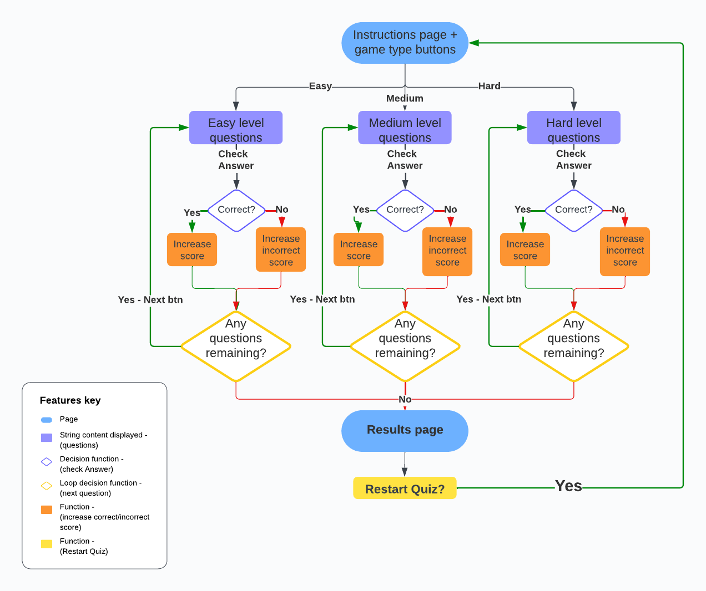

# Star Wars Quiz

## Project Overview

Star Wars Quiz is an online quiz with the aim of attracting fans who want to test their knowledge of the Star Wars universe.  It facilitates users with the possibility to choose the level of difficulty and find more challenging questions about the topic they are so passionate about.

This website aims to appeal to fans of all ages as it includes questions in regard to content seen within all the films throughout the Star Wars saga. It also should aim to generate some interest as to the overall backstory of each character as well as the main plot itself.

### Live Website

You can visit the website [here](https://jonathandussot.github.io/star-wars-quiz/)

### My GitHub Repository

You can visit the GitHub Repository [here](https://github.com/JonathanDussot/star-wars-quiz)

## CONTENTS

## User Experience (UX)

### Common Usage

- The _Star Wars Quiz_ is an online quiz aimed to test the knowledge of Star Wars fans around the world.
- Quiz contestants could enjoy this type of trivia quiz at a gathering to give their evening a fun and competitive element.
- In the case of a younger audience or newcomers to the _Star Wars_ franchise, it may help to spark an interest and further feed their curiousity and facilitate their inclusion to an ever-growing community that has been so widely popular in every culture for almost half a century.

## User Stories

- I want to put my knowledge to the test in this particular topic.
- I want to be able to choose a level of difficulty that is suitable to me.
- I want to be able to easily navigate through the page and understand clearly its different functions and information presented to me.
- I want it to be dynamic and fun so I can enjoy myself either alone or in the company of my friends whilst going through the quiz.

## Design

### colour scheme

I designed the colour palette for the website myself. I only used [colormind.io](http://colormind.io/) to display the color palette of primary colours used.  Here is the list of colours used:

- #111111, #333333, #dddddd, #eeeeee

  - These colours were quite basic shades between black, grey and white.  The reason being for this is that it suited the theme of _Star Wars_ perfectly, as I gave each colour a certain degree of transparency depending on the element it was used on, so that the background image of outerspace, which also happens to be black and white, can be fully appreciated at all times.

- #3333ff, #00c00, #cc0000

  - These are secondary colours found throughout the page specifically in the button elements.  The first colour is used as an active effect for the the user has clicked on an option, where as the second and third colour indicate whether an answer is right or wrong, respectively.

### Typography

I used Google Fonts to import the following:

- 'Libre Franklin' is a sans-serif style which I chose due to its close resemblance to the font used within _Star Wars_ to help give it a slightly familiar vibe to the quiz participants.

### Imagery

All the images added to the quiz are related to the franchise.  The background image has the purpose of setting the theme of the quiz, while more specific images within the body such as Yoda in the instructions and the villains within the game-difficulty buttons are set to give the user somewhat of a role as they start the quiz. The sources of each image used can be verified in the credit section below.

### Wireframes

I created these wireframes using Balsamiq.

#### Home Page

This is the home page with the instructions.  Some minor changes were made in terms of the buttons available to start running the quiz.

#### Quiz Questions

An example of the questions and answers shown. The image to the right shows the reaction upon the user's interaction to an answer.

#### Results Page

A screenshot with the results of the quiz with the option to restart the quiz which takes the user back to the home page.

### Intelligent Diagramming chart

I created this Intelligent Diagram using Lucid Chart

## Features

### General Features on each page

The page is responsive and contains:

- Favicon of the Website
  - chosen to match the theme of the site.

- Landing Page
  - This would be the first page the user would see, introducing the theme with an image, bakkground image and the instructions explaining how to play the game, clearly stating there are three levels of difficulty.

- Different levels of difficulty
  - Here users are given an exciting presentation to the aforementioned three levels so they may visualise the difficulty based on the villain they can select, this is achieved with the help of transparent png-format images and names of well-known villains to face.

- Questions Display
  - This image shows how users on differently-sized screens have the possibility of seeing questions and answers on the same screen.

- Questions Display with a selected answer
  - Once the user selects an answer, different colours are displayed to show if they were correct.  The user is also given a 'next' button which allows the user to go onto the next question.

- Results Page
  - A screen will appear with the user's total score along with a feedback message which varies depending on the range of questions correctly answered. The message is worded in a particularly order to resemble Yoda's speech, who can be seen in the image.  This is to give the user the full experience of being immersed in the _Star Wars_ universe.

- Sound Effects
  - sdsdsdsdsdsds

- Question counter
  - sdsdsdsdsdsds

### Future Implementations

ideas for future implementations I would like to include are:

1. A feature to request usernames and provide users with a list of highest scores for the users to compete with.
2. A multi-player feature for participants to compete remotely head-to-head on different devices along with the possibility for them to challenge participants to these head-to-head games.
3. Another multi-player feature mode that will allow players to compete locally in teams to provide users with a fun party game.

### Accessibility

In order to ensure that this website is as accessible friendly as possible, the following measures have been taken:

- Using semantic HTML elements.
- Providing descriptive alt attributes for all images for users with visual impairments.
- Providing information for screen readers for some features on the page.
- Ensuring there is a sufficient colour contrast throughout the site.
- I used Lighthouse and wAVE to ensure good measures were taken for accessibility.
- instructions guide the user through the game's dynamics.

WAVE displays an error within the footer stating there is a low contrast and that both text color and background color are white.  However, the text color is clearly visible in contrast to the background image which is evidently a very dark colour.

## Technologies Used

### Languages Used

The languages used for the website include HTML, CSS and JavaScript.

### Libraries and Programs Used

[icons8.com](https://icons8.com/icons) to create favicon.

[Tiny PNG](https://tinypng.com/) to compress images.

[GitHub](https://github.com/) to save and store my website.

[Codeanywhere](https://app.codeanywhere.com/) IDE I used for this project.

[Google Fonts](https://fonts.google.com/) to import fonts used on the site.

Google Dev tools - to test and fix issues detected.

[freepik](www.freepik.com) to download and use my background-url image.

[Am I Responsive?](https://ui.dev/amiresponsive) to show site on all different screen sizes.

[Colormind.io](http://colormind.io/)  to generate color palette used.

[Balsamiq](https://balsamiq.com/) to create wireframes.

[Lucidchart](https://www.lucidchart.com/pages/) to create intelligent diagramming chart.

## Deployment And Local Development

### Deployment to GitHub pages

The site is deployed using GitHub Pages. To deploy using GitHub pages:

1. Open the project repository.
2. Click on "Settings" on the navigation bar under the repository title.
3. Click on "Pages" in the left-hand navigation panel.
4. Under "Source", choose which branch to deploy. This should be Main for newer repositories.
5. Choose which folder to deploy from, usually "/root".
6. Click "Save", then wait for it to be deployed. It can take some time for the page to be fully deployed.
7. Your URL will be displayed above "Source".

You can visit the website [here](https://github.com/JonathanDussot/star-wars-quiz)

### Local Deployment

#### How to Fork

1. Copy the link to this repository.
2. Log in or sign up to your GitHub account and click on the **Fork** button on the top-right corner.
3. You should now have a copy included in your account.

#### How to Clone

1. Copy the link to this repository.
2. Log in or sign up to your GitHub account and click on the **Code** button.
3. You are given to option to clone using HTTPS or GitHub CLI and copy the link.

## Testing

click [here](TESTING.md) to see the all the details in regard to the testing done on the site.

## Credits

### Content

- The information I got for my questions mostly came from [buzzfeed](https://www.buzzfeed.com/laurafrustaci/star-wars-trivia)

### Media

- The [3d-space-image.jpg](assets/images/3d-space-image.jpg), was taken from [freepik.com](www.freepik.com) from an author named [@kjpargeter](https://www.freepik.com/author/kjpargeter) to give that outerspace, sci-fi feeling theme to my quiz.

[3d-space-image.jpg from freepik](https://www.freepik.com/free-photo/3d-hyperspace-background-with-warp-tunnel-effect_8879794.htm#query=star%20wars&position=0&from_view=search&track=ais&uuid=2743de4c-8bee-445b-a1a5-01771d3ccbf6)

- The [star-wars-logo.jpg](assets/images/star-wars-logo.jpg) was taken from the [infonegociosmiami](https://infonegocios.miami/) website, which gave me the perfect looking logo for the quiz offering a great colour contrast due to its font-colour and width of the lettering.

[star-wars-logo.jpg from infonegociosmiami](https://infonegocios.miami/impact-mkt/conocida-en-todas-las-estrellas-explorando-el-legado-del-logo-de-star-wars-una-odisea-de-diseno-y-marca-parte-i)

- The [yoda.png](assets/images/yoda.png), [darth-maul-img.png](assets/images/darth-maul-img.png), [darth-sidious-img.png](assets/images/darth-sidious-img.png) and [darth-vader-img.png](assets/images/darth-vader-img.png) were all transparent png images used within my game to give it a nostalgic and dynamic feeling to all users going through the experience provided by the quiz.

[yoda.png](https://pngimg.com/image/109430)

[darth-maul-img.png](https://www.iconarchive.com/show/star-wars-characters-icons-by-jonathan-rey/Darth-Maul-02-icon.html) created by Jonathan Rey.

[darth-sidious-img.png](https://www.pngkey.com/maxpic/u2e6w7i1a9a9a9a9/) created by The HD Colin Powell Anthrax.

[darth-vader-img.png](https://pngimg.com/image/28358)

- The sound media files [gamestart-sound.mp3](sounds/gamestart-sound.mp3), [correct-sound.mp3](sounds/correct-sound.mp3) and [incorrect-sound.mp3](sounds/incorrect-sound.mp3) were all taken from [soundfxcenter](https://soundfxcenter.com/).

[All sound files](https://soundfxcenter.com/sound-effects/star-wars/210)

## Acknowledgements

I would like to acknowledge the following people who have been a huge help for my very first milestone project:

- [Lauren-Nicole](https://github.com/CluelessBiker) - My Code Institute Mentor for her vast amount of knowledge, relaxing demeanour and patience!

- [Kera Cudmore](https://github.com/kera-cudmore) - for her constant support through the slack community and tutorials.

- Arwen Dussot - my newborn daughter for keeping me awake at night and 'on my toes' so to speak.
