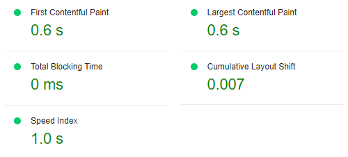
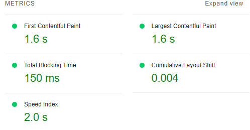

# Star Wars Quiz - Testing

## Live website

You can visit the website [here](https://jonathandussot.github.io/star-wars-quiz/)

## CONTENTS

- [Star Wars Quiz - Testing](#star-wars-quiz---testing)
  - [Live website](#live-website)
  - [CONTENTS](#contents)
  - [W3C Validator](#w3c-validator)
  - [JSHint](#jshint)
  - [Wave](#wave)
  - [Lighthouse](#lighthouse)
  - [Manual Testing](#manual-testing)
    - [Testing User Stories](#testing-user-stories)
      - [User Stories](#user-stories)
    - [Functionality tests](#functionality-tests)
      - [Button Testing](#button-testing)
      - [Browser Testing](#browser-testing)
  - [Solved Bugs](#solved-bugs)
  - [Unfixed Bugs](#unfixed-bugs)

## W3C Validator

I used the W3C Validator to validate the HTML and CSS code from my page. Results can be seen in the screenshots below:

[index.html](index.html) - returned no errors or warnings
[screenshot of index.html being validated](documentation/sw-w3c-html.png)

[style.css](assets/css/style.css) - returned no errors or warnings
[screenshot of style.css being validated](documentation/sw-w3c-css.png)

## JSHint

I used JSHint to validate the JavaScript code from my page. Results can be seen in the screenshots below:

[script.js](assets/js/script.js) - returned 47 warnings as seen in screenshot, no errors found.
[screenshot of script.js being validated](documentation/sw-js-hint.png)

## Wave

I used WAVE to verify the performance of the site. All tests passed on the page.

## Lighthouse

I used lighthouse in Google DevTools to verify the site passed all tests.These are the results on a Desktop:

And these are the results on a mobile screen:

## Manual Testing

### Testing User Stories

#### User Stories

| Goal | How is this achieved? |
|---|---|
|I want to put my knowledge to the test in this particular topic.| The quiz offers many questions ranging from the oldest to the newest trilogy in the saga.|
|I want to be able to choose a level of difficulty that is suitable to me.| The quiz provides users with three different difficulties for them to test their knowledge. |
|I want to be able to easily navigate through the page and understand clearly its different functions and information presented to me.| The home page gives information through the instructions of how to navigate through the quiz.|
|I want it to be dynamic and fun so I can enjoy myself either alone or in the company of my friends whilst going through the quiz.| A variety of dynamic functions are included such as sounds and images of characters within the _Str Wars_ universe. Other functions to make the game more dynamic among friends will be implemented in future implementations.|

### Functionality tests

#### Button Testing

| Items being tested | Actions taken to test | Expected result | Outcome |
|---|---|---|---|
|Button - Hover.| Moved mouse over button.| The button changes colour (#eeec) to detect the mouse hovering over it. | :white_check_mark: |
|Buttons - Select.| Clicked on button | The button changes colour (#33fc) to detect the mouse clicking on it.| :white_check_mark: |
|Game-type button - Sound| Clicked on game-type button | The button triggers the gamestart-sound.mp3 upon being clicked.| :white_check_mark: |
|Game-type Buttons - link to string| Clicked on each. | Each game-type button leads to their respective string of questions.| :white_check_mark: |
|Answer button - Select.| Clicked on an answer button | Correct and incorrect options are highlighted in different colours before then displaying the next button.| :white_check_mark: |
|Next button - function.| Clicked on the 'next button' | The next button leads to a randomly shuffled question within the same question string.| :white_check_mark: |
|Results page button.| Clicked on results page button | The button leads to the results page with the amount of correct answers and a customized feedback message.| :white_check_mark: |
|Restart quiz button.| Clicked on the 'restart quiz' button | The restart button leads to the home page with the instructions and game difficulties.| :white_check_mark: |
|Star Wars logo.| Clicked on the _Star Wars_ logo | The logo leads to the home page with the instructions and game-type difficulties| :white_check_mark: |

#### Browser Testing

| Items being tested | Actions taken to test | Expected result | Outcome |
|---|---|---|---|
|Browsers| Opened the page on Microsoft Edge and Google Chrome | The page works with no errors at all on different browsers.| :white_check_mark: |
|Page's sizing.| Re-adjusted screen on Google DevTools to verify all sizes, as well as devices. |The page returns no errors upon adjusting screen sizes or checking on different devices.| :white_check_mark: |

## Solved Bugs

- I had a problem with showEasyQuestions function, it would not append child and said the function was not valid but when I switched element from ClassName to Id, the bug was fixed.

- Another problem I had was with the highlighting of the correct option when an incorrect option was selected. This was corrected by adding an additional isCorrect variable.

- I also had a problem with displaying final result innerHTML code, because my finalResult var was declared inside the 'if' conditions,
so I couldn't access it. The solution was to declare the finalResult outside the 'if' blocks so they update.

## Unfixed Bugs

- None that I'm aware of.
